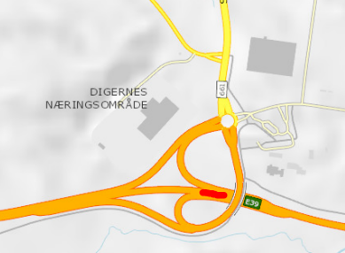

# Dobbeltsjekk av kall mot `veg` - endepunkt som feiler

Vår leverandør Viatech har levert liste over kall mot `veg` som feiler 
for fylke 15, men som er gyldige vegreferanseoppslag. 

Jeg stusser litt på deres konklusjoner, og mistenker kanskje at 
de har brukt en tidligere versjon av datasettet, hvor disse manglene
definitivt var til stede. Jeg må imidlertid sjekke litt grundigere
for å finne ut hvordan dette henger sammen. 

Datagrunnlag i mappen `data_fylke15viatech`

Viatech rapporterer om  1952 *tomme celler* i data jeg har sendt dem for fylke 15. I FME-loggene for fylke 15 sendt den 13. februar finner jeg imidlertid 488 feilsituasjoner, fordelt likt på V2 og V3. 

```
In [15]: %run analyserlogg_dobbeltsjekkfeil.py
Åpner FME loggfil oppsummering data_fylke15viatech/fmekall_veglenke.log 
Antall feil V2 244 / 10842 Feilrate= 2  %
Antall feil V3 244 / 10842 Feilrate= 2  %
Antall kall som lykkes i den ene Api-versjonen men feiler i den andre 0
Antall feilsituasjoner vi prøvde om igjen med SUKSESS 0 / 488 0 %
Antall feilsituasjoner som fremdeles feiler 488 / 488 100 %
```

### Gransking av aller første forekomst i feilrapport fra Viatech

Viatech sin fil `data_fylke15viatech/Fylke 15 - GenMethodfileFromCvs20200213_041246.txt` oppsummerer de vegsystemreferansene som mangler i 
de dataene jeg sendte dem. Her er første oppføring fra fila
```
Mangler 'ny_vegsystemreferanse_fra' for 0.63720528@2179875, ReflinkOID : 0.63720528@249525 <-> 0.68579931@249525, Org vegRef.: 1500Ev39hp16m0 - 1500Ev39hp16m30
	ny_vegsystemreferanse_fra, lesAPI :0.63720528@2179875 -> EV39 S30D1 m4834
``` 
Oppgitt vegreferanse i "Fra" - posisjon er `1500Ev39hp16m0`, skrevet som visveginfo-syntaks: `1500EV0003901600000`. I FME-loggen finner vi dette kallet til visveginfo: http://visveginfo-static.opentns.org/RoadInfoService/GetRoadReferenceForReference?roadReference=1500EV0003901600000&topologyLevel=Overview&ViewDate=2012-02-13

Som returnerer posisjon 0.45825379 på veglenkesekvens 249525. Dvs kortform 0.45825379@249525 som brukes i følgende oppslag mot NVDB api v3 
https://www.vegvesen.no/nvdb/api/v3/veg?veglenkesekvens=0.45825379@249525
Denne biten av veglenkesekvens 249525 ble imidlertid satt historisk, noe du finner ut ved å granske historien for veglenkene https://www.vegvesen.no/nvdb/api/v3/vegnett/veglenkesekvenser/249525

**Dette eksemplet SKAL altså være ugyldig - den vegen som fantes med vegreferanse 1500Ev39hp16m0 i 2012 finnes ikke lenger**. Her kom det ny kryssløsning E39-Fv661


 

# Opppsummering, alle fylker 

Her er for øvrig min nyeste sjekk av de veglenkeoppslagene som feiler i datasettet `data13februar` (gamle vegreferanser fra Viatech som skulle oppfriskes med riktig stedfesting (per angitt dato) og nye 
vegreferanseverdier). Datagrunnlag i mappen `data13februar`


```
Antall feil V2 8261 / 195547 Feilrate= 4  %
Antall feil V3 8241 / 195547 Feilrate= 4  %
Antall kall som lykkes i den ene Api-versjonen men feiler i den andre 112
Antall feilsituasjoner vi prøvde om igjen med SUKSESS 0 / 16502 0 %
Antall feilsituasjoner som fremdeles feiler 16502 / 16502 100 %
```
