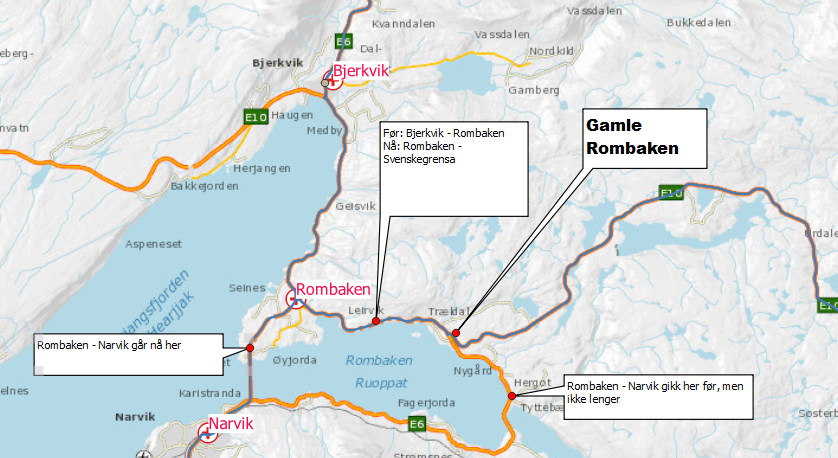

#### Hålogalandsbrua nord for Narvik åpnet sent i 2018


Lang og kompleks forklaring som jeg er uenig i: 

```
Her må vi:
Functional node Rombaken må flyttes til Bjerkvik (Stormyra på kartet under - nytt kryss ml E6 og E10)
Functional link «Rombakken – Mo i Rana, Roavegieddi – Rombakken 
og Rombaken - Border Norway/Sweden – Bjornefjell må endres med 
Bjerkvik i stedet for Rombaken
Dette vil medføre at Rombakken – Mo i Rana blir kortere, 
Roavegieddi – Rombakken blir kortere og Border Norway/Sweden blir lengre.
Den delen av E6 som går mellom dagens punkt Rombaken og Narvik må utgå 
(selv om den fortsatt er E6 er den ikke lenger TEN-T og den skal omklassifiseres til fylkesveg (nr 7575??)). 
Vedtaket er gjort men ikke iverksett 
fordi det forutsetter noen tiltak som må utføres først.
Logical nodes kan muligens bare være slik de er, men Logical sections må 
endres slik: Rombakken - N-NO-006.02 Narvik må bli Bjerkvik – N-NO-004.19 – Narvik.
```

Hvorfor må vi endre strekningsdefinisjonene? Og gjøre det så komplisert? Og hva har Bjerkvik med saken å gjøre, vi flytter jo ikke på den? 

Noden Rombakken er flyttet til krysset E6/E10 ved Stormyra. Den overordnede nettverkstopologien - hva strekningene heter, hvilket navn de har og hvordan de henger sammen - er IKKE påvirket. Eneste endring er at tre av strekningene har endret lengde og en av dem har en helt ny trasé. 

  * Bjerkvik - Rombaken er kortet inn 
  * Rombaken - Svenskegrensa er blitt lengre
  * Rombaken - Narvik har fått helt ny trasé. 
  
  
 


TEN-T strekningene på stedet er selvsagt oppdatert. 


#### NO-014.03  Vinterbru/Aarungen 

_har nå lengde 1 km mens det var 5 km i forrige leveranse._

Tunnelredigering, måtte legge inn tunnel på ny. Skal være OK. 


##### NO-109.04         Mysen/Border Norway/Sweden – Orje 

_her er det en økning på 13 km og det skjønner jeg ikke. Det er bygd ny veg her, så det er mulig at vi tar med begge deler. Dette er E18 og strekningen åpnet i desember 2017. Den var derfor åpnet ved forrige uttak._

Nei, det var den ikke - det husker jeg! Det var anleggsveg og blanding av nytt og gammelt **ved datauttak**_. 


#### NO-100.29         Knarvik/Aasane  

_nord for Bergen øker med 2 km og det har ikke skjedd noe her_

Ingen spesiel forklaring. Kan ta et skråblikk på forrige års datadump. Kan også dobbeltsjekke at toløpstunnell ikke blir telt to ganger. 


#### NO-101.02         Biskophavn/Bergen 

_øker med 4 km og det har ikke skjedd noe her. Samtidig har jo trafikkarbeidet økt betydelig._

Kan ettergå at ikke toløp telles 2x. 

#### NO-021.12         Skogn/Stjordal 

_nord for Trondheim er redusert med 5 km, men jeg er usikker på om det har skjedd noe her._

Jo - ny veg, og manglet noe km. **fiksa**

#### NO-018.02         Gamlebyen/Ryen 

_mangler et løp – det er toløps tunnel på denne strekningen_

**fiksa**


